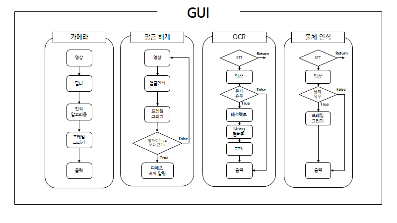

# PyQT OCR and Face and Object Detection Project   
Qt에서 작동하는 실시간 얼굴인식 및 물체 객체 검출과 OCR(광학식 문자 판독)  인식 알고리즘들을 각 버튼으로 제어 할 수 있는 프로젝트 
---

* #### 💡 구동 환경
  * CPU: Intel I7-10700K  
  * RAM: 16GB  
  * GPU: NVIDIA RTX 3080  
  * LAN: 1Gbps 
  * OS: Windows 10
  * <a href="https://store.arduino.cc/products/arduino-uno-rev3-smd?queryID=undefined" target="_blank">Arduino Uno Rev3 SMD</a>
  * USB WebCam
  * IDE: Pycharm, Pyqt5 Designer, Arduino IDE

  
---

<!-------------------------------------------------------------Part 1------------------------------------------------------------------------------------------>
 ## 1. 개요
 1. __목표__
    * 다양한 종류의 인식 알고리즘을 적용한 어플리케이션  
    * 인식과 관련하여 어떠한 형태로든 STT/TTS 기능 추가
    * 인식결과를 아두이노 보드에 장착된 각종 장치와 연동
    * UI를 사용하며 UI안에서 모든 프로세스를 처리하는 사용자 인터페이스 구축
    * 멀티스레드 사용 
    
    

 2. __구동 화면__  
    
  
    
---      
 ## 2. 블록도 설명

  

  

 1. __버튼 이벤트__  
    카메라 켜기 버튼 클릭 시 카메라로 부터 영상을 받아 UI에 실시간 출력  
    * 좌측 체크박스 체크 시 각 필터에 해당하는 인식 알고리즘 작동 
    
    잠금해제 버튼 클릭 시 얼굴을 인식한 뒤 학습한 얼굴과 비슷한 정도를 비교하여 잠금을 해제
    * 잠금해제 성공 시 아두이노 내장 피에조 버저로 알림
    
    OCR 버튼 클릭 시 카메라에서 문자 유무를 판별하여 출력
    * 문자 유무 판별 시 문자가 있다면 문자열로 형변환 후 TTS 출력
    
    물체인식 버튼 클릭 시 STT를 사용하여서 카메라 영상을 출력하고 출력한 영상 안에서 객체검출 출력
    * 인식한 물체의 정확도(%)와 해당하는 이름 출력 
    
    
---  
 <!-------------------------------------------------------------Part 2------------------------------------------------------------------------------------------>

    
## 5. 오류 및 해결
   * __OCR 결과를 TTS로 출력 시 오류__     
     > TTS API 오류 및 인식 결과를 출력하지 못하는 문제 → 인식 결과를 텍스트로 저장하고 저장한 내용을 다시 읽음으로 해결
     > 1번만 작동하고 충돌 발생 → 루프문과 예외처리문으로 해결
     > 특수문자 오류 → 인코딩 디폴트 값 UTF-8 지정

   * __OpenCV 오류__    
     > Callback오류 → 웹 캡쳐시 백엔드 설정 후 해결  
     > 버전 문제에 따른 경고문 → Try:pass로 해결  

   * __Yolo Weight 및 h5 파일 오류__  
     > 실행 후 인식 불가 → 해당 로컬파일 디렉토리로 이동 후  weight파일 및 h5파일 삭제 후 재설치로 해결       
     
     
